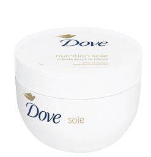

Encore un cadeau que je n'utiliserai pas. Pour quelles raisons ? Je pense que ce produit n'est pas sain pour la peau et je vais le prouver à travers cet article. Comme toujours pour l'écriture d'un article je vais sur le site du fabricant ou je regarde sur le pot. La liste est longue et difficile à comprendre pour les non-chimistes comme moi. Bref je n'y comprends rien comme la majorité des consommateurs. C'est pourquoi, j'ai pris du temps pour aller me renseigner sur chaque ingrédient que contenait cette crème. Néanmoins, j'ai bien les ingrédients cependant je n'ai pas les quantités.

##Décryptage de la crème nourrissante pour le corps Dove

* Aqua : eau. L'eau sert de solvant.
* Cyclopentasiloxane : en français : Cyclométicone. c'est un silicone utilisé comme agent anti-statique, émollient, conditionneur capillaire, humectant, solvant et agent de contrôle de la viscosité. 
* Sorbitol : agent humidifiant et épaississant.
* Capric Triglyceride : Huile de coco fractionnée. Emollient, hydratant, solvant, agent texturant, agent masquant, agent d'entretien de la peau, texture "huile sèche", ne laisse pas de film gras sur la peau, non comédogène, stable à l'oxydation.
* Stearic Acid : agent nettoyant, agent émulsifiant, stabilisateur d'émulsion, agent masquant, agent de restauration lipidique, tensioactif.
* Helianthus Annuus Hybrid Oil : émollient.
* Isohexadecane : émollient, hydratant, solvant.
* Glycol Stearate : émollient, agent émulsifiant, agent opacifiant, tensioactif.
* Dimethicone : agent antimousse, émollient, hydratant, agent de protection de la peau, agent d'entretien de la peau.
* Collagen Amino Acids : agent anti-statique, agent filmogène (produit un film continu sur la peau, les cheveux ou les ongles, conditionneur capillaire), humectant (maintient la teneur en eau d'un cosmétique dans son emballage et sur la peau), agent d'entretien de la peau.
* Isomerized Linoleic : pas d'informations précises
* Lactic Acid : Présent dans le vin, certains fruits et légumes, et dans les muscles. Capacité particulière à pénétrer la peau.

La liste des ingrédients est longue. Je ne suis pas persuadée que cela soit bénéfique pour ma peau. De plus la plupart de ces ingrédients proviennent de l'industrie pétrochimique, ce qui est une castastrophe pour l'environnement. Enfin, en terme d'odeur du produit, je préfère les parfums plus léger et moins agressif.

##Définitions
* Solvant : Substance le plus souvent liquide qui a la propriété de dissoudre une autre substance.
* Emollient : Se dit d'une substance qui relâche, détend, adoucit et amollit.
* Non comédogène : n'obstue pas les pores de la peau.
* Tensioactif : Un tensioactif est une substance modifiant la tension superficielle entre deux surfaces. Les tensioactifs se composent de molécules amphiphiles présentant un côté lipophile (affinité pour les lipides) et un côté hydrophile (affinité pour l'eau). Cette propriété leur permet également de solubiliser deux phases non miscibles (Deux liquides sont dits miscibles quand ils se mélangent totalement l'un dans l'autre (cf. eau et vinaigre miscibles et eau et huile immiscibles).

##Les produits dangereux pour la nature et l'homme
* Le cyclopentasiloxane : ingrédient numéro 2. "Le cyclopentasiloxane fait partie de la famille des Silicones. Des études ont démontré au Canada qu'il était toxique pour l'environnement et les milieux aquatiques. En Europe, il est classé en tant que perturbateur endocrinien et serait potentiellement néfaste pour la reproduction et la fertilité. Des tests en laboratoires ont conclu que des expositions à forte dose de Cyclopentasiloxane pouvaient causer des tumeurs utérines et influer sur le système immunitaire et reproducteur. Par sécurité, il vaudrait mieux éviter tous produits en contenant."
* Sorbitol : ingrédient numéro 3. Cet ingrédient est autorisé pour la fabrication de produits bio. Néanmoins, j'ai lu des articles concernant cet ingrédient affirmant qu'il présentait des risques notamment en cas de grossesse.
* Isohexadecane : ingrédient numéro 7. Huile minérale dérivée de l'industrie pétrochimique. C'est un solvant. "Une exposition régulière, même à faible dose, peut entraîner à plus ou moins long terme des atteintes à la santé, dont certaines sont irréversibles. Priorité doit être donnée à la substitution des solvants dangereux."
* Dimethicone : ingrédient numéro 9. Silicone.

##Sources
* Larousse (solvant) : https://www.larousse.fr/dictionnaires/francais/solvant/73366
* Larousse (émolliant) : https://www.larousse.fr/dictionnaires/francais/%C3%A9mollient_%C3%A9molliente/28811
* INCI Beauty : https://incibeauty.com/ingredients/20580-cyclopentasiloxane
* Que choisir : https://www.quechoisir.org/decryptage-produits-cosmetiques-les-fiches-des-molecules-toxiques-a-eviter-n2019/#cyclopentasiloxane-cyclotetrasiloxane-cyclomethicone
* Energica Natura : http://www.energeticanatura-blog.com/fr/medical/le-sorbitol-mieux-vaut-leviter/
* Futura Sciences : https://www.futura-sciences.com/sciences/definitions/chimie-tensioactif-11288/
* CosmeticOBS : https://cosmeticobs.com/fr/ingredient-cosmetique/isohexadecane-571/
* INRS (article sur les solvants) : http://www.inrs.fr/risques/solvants/ce-qu-il-faut-retenir.html
* Les ingrédients à éviter dans les cosmétiques. http://www.galasblog.com/14-ingredients-a-eviter-dans-les-cosmetiques/

* 
##Analyser vos produits de beauté
Pour analyser facilement vos produits de beauté, vous pouvez télécharger l'application INCI Beauty qui se charge de tout vous expliquer. https://incibeauty.com/

