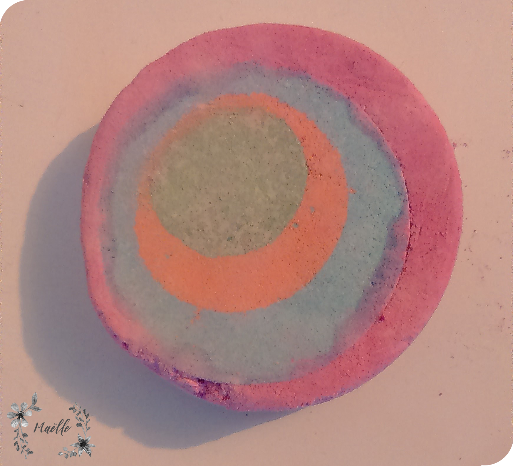
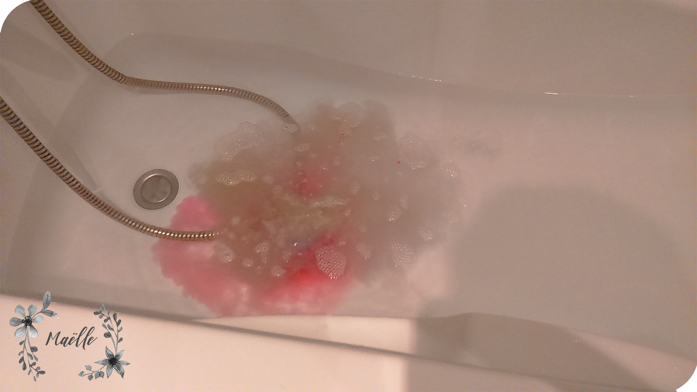
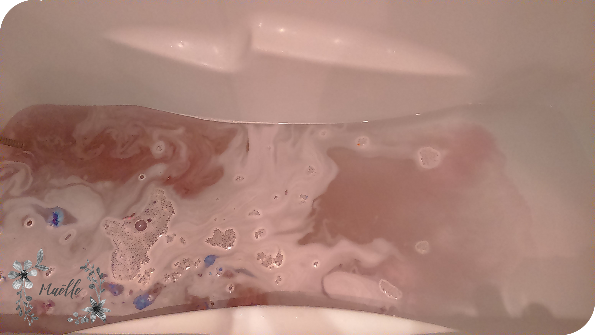

A Noel, comme chaque année avec une quinzaine d'amis nous organisons un dîner de Noël entre amis, histoire de bien manger et de s'offrir des petits cadeaux entre copains. Pour les cadeaux, c'est le hasard qui choisit : chacun offre un cadeau à une personne, le choix s'effectue par tirage au sort. Le décor étant planté, cela m'amène au sujet de ce billet. L'année dernière, lors de ce dîner une amie m'a offert une bombe de bain Lush : une Granny takes a dip de Lush. Je ne savais pas ce que c'était mais histoire de ne pas mourir complètement bête, je vais la décrypter et l'essayer. Une année est passée et je n'ai toujours pas utilisé son cadeau car je n'en n'avais pas eu l'occasion.

Pourquoi ?
1 : Car malgré une véritable stratégie marketing bien ficelée sur les produits Lush, j'ai entendu beaucoup des critiques négatives qui ont touché ma corde sensible (je parle de l'écologie bien sûr). Cependant, je suis rentrée une fois dans le magasin et j'ai presque craqué.

2 : Je doute du bien-fondé de ces produits.

3 : Dans mon ancien appartement, j'avais une baignoire mais je prenais très rarement des bains (pas assez écologique).

J'ai cependant essayé ce produit mais de plonger dans mon bain, j'ai décrypté et tester pour vous ce produit.

Pourquoi acheter un "Granny takes a dip" ?
0 : Parce que ce produit porte un titre écrit en anglais et que ça fait travailler ton anglais.

1 : Parce que sur l'étiquette du produit c'est écrit : "cosmétiques frais faits main" et on y croit !

2 : D'après la description du produit sur le site de Lush, ce pain moussant est rajeunissant avec un effet psychédélique. Mouais, je suis complètement ok pour faire du marketing mais "il ne faut pas pousser grand-mère dans les ortie". Le rajeunissement je n'y crois pas et je ne vois pas d'effet psychédélique. Je vois plus un amas de pâte à modeler fait par un enfant de 5 ans.

3 : Je viens de me rendre compte que ma copine a comme même payé cher cette "crap" (moi aussi je sais utiliser des mots anglais).

4 : L'odeur de ce truc n'est pas top. J'ai récemment été sur le chantier d'un ami qui cassait des mûrs de pâtre, ça sentait la même chose. Ne mettre ce produit prêt du nez pour le respirer (j'ai eu une petite toux).

5 : J'ai eu de la poussière de pain moussant partout dans ma salle de bain. Produit à laisser dans son emballage d'origine.

6 : Les ingrédients ne donnent pas envie de mettre ça sur ma peau. Chez Lush, ils ont tout compris, sur chaque ingrédients ils mettent un lien vers la description de cet ingrédient sauf pour les colorant où on ne voit qu'une image du colorant et un court paragraphe sur la couleur. Bref, grosse déception sur la description du produit où l'on m'a servit que du texte marketé, soigné pour vendre le produit. C'est pourquoi je me suis rendue pour la plupart du temps sur Wikipédia et sur le site de l'Observatoire des Cosmétiques.

La liste des ingrédients :
En gris, les ingrédients qui ne sont pas présent dans mon pain moussant mais présent dans ceux présentés sur le site. La liste des colorants dépend de votre pain moussant.

* Bicarbonate de soude : produit naturel ou de synthèse, non nocif pour la santé. Agent alcalinisant, qui augmente le pH des préparations acides.
* Acide citrique : présent naturellement dans le citron, non nocif pour la santé. Cependant, comme tout acide, il est irritant et peut provoquer des brûlures s'il entre en contact prolongé avec des muqueuses. Régulateur de pH, agent de chélation (stabilité du produit), agent masquant (réduit les odeurs).
* Crème de tartre : Le tartre, qui se trouve naturellement dans le raisin, se cristallise dans les tonneaux de vin pendant la fermentation du jus de raisin. Cette forme brute est récoltée et purifiée pour produire une poudre blanche, inodore et acide. Non nocif pour la santé. C'est l'ingrédient avec lequel j'ai plus rigolé car j'ai pensé au tartre sur les dents !
* Laurethsulfate de sodium : détergeant et surfactant. C'est un agent moussant, il permet également de mélanger deux produits (comme l'eau et l'huile). Issu d'un processus industriel, il passe dans la catégorie alcool.
* Laurylbétaïne : agent antistatique, agent nettoyant, conditionneur capillaire (laisse les chevaux facile à coiffer), agent d'entretien de la peau, tensioactif (favorise la répartition uniforme du produit), synergiste de mousse (améliore la qualité de la mousse).
* Farine de maïs
* Des huiles essentielles  : citron, poivre noir, gingembre.
* Extrait  de gardenia : parfume le produit
* Dioxyde de titane : utilisé comme pigment et opacifiant. Toxicité possible pour l'homme (d'après le Centre international de recherche sur le cancer) et écotoxité pour l'environnement.
* Citral : composants aromatiques. Élément de l'huile de citronnelle.
* Limonène : parfume les produits et solvant.
* Potassium aluminium silicate (Lush, corrigé vos fautes d'orthographe) : agent de foisonnement (réduit la densité apparente des produits cosmétiques), agent abrasif (élimine les matières en surface des diverses parties du corps, aide mécaniquement au nettoyage des dents ou augmente la brillance).
* Des colorants (bien sûr !). Je n'ai pas fait de recherche sur tous les colorants présents dans ce produit mais juste pour rigoler je suis allée voir l'un des colorants présents dans l'un des pains moussants présents sur le site (premier colorant pris sur la Granny réf 6143). Colorant 7005 = Jaune de quinoléine =  mise en cause le jaune de quinoléine dans les syndrome d'hyperactivité des enfants. Considéré aussi comme allergène possible. Colorant 42090 = Bleu brillant FCF = utilisation controversée.

Bon c'est vrai que grâce à cette liste on voit qu'en terme de nombre d'ingrédients peu sont nocifs pour l'environnement ou la santé. Cependant on ne connaît pas la quantité de ces ingrédients présents dans le produit (combient de % d'huile essentielle ?). C'est sûr avec tous ces produits je vais être propre et sentir bon. Mais je vais devoir surtout mettre beaucoup mais vraiment beaucoup de crème hydratante si je ne veux pas que mon corps soit desséché.

##Le test

Comme vous pouvez le constater ça n'a pas beaucoup moussé. 

La couleur bleue a eu du mal à se dissoudre, de plus elle est complètement occultée par la couleur rose. Après un petit mélange de l'eau, l'eau du bain était un peu plus rosé.

Grosse déception, la pain promet d'être moussant, il n'y a quasiment pas eu de mousse (peut-être que mon pain était trop vieux), ensuite ça sentait toujours la même odeur qui n'était pas très agréable. Enfin, l'effet sur ma peau n'était pas agréable non plus, j'ai finalement pris une douche !

Site du produit :
https://www.lushusa.com/granny-takes-a-dip/05193.html

