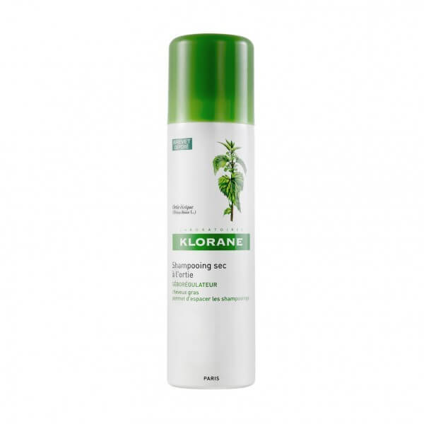

Il y a quelques temps on m'a parlé de shampoing sec je me suis tournée vers le shampoing de Klorane.

Ce produit est pratique car il évite de se laver les cheveux à chaque fois qu'ils sont gras. Je vais donc vous décrypter ce produit. Tout d'abord, j'ai trouvé ce produit efficace. Néanmoins, je n'en rachèterai pas car j'ai vidé la bouteille en 3 fois alors que je n'ai pas les cheveux gras. Ce produit a plutôt eu tendance à assècher mes cheveux qui sont déjà secs. Ensuite, j'ai trouvé ce produit cher.
Enfin, comme dans la plupart des produits industriels il y a beaucoup d'ingrédients et je ne suis pas sûr que cela soit bon pour l'environnement et pour ma santé. La liste détaillée et commentée se trouve sur la site de beauté-test. Bref, j'ai vidé la bouteille (car je n'aime pas jeté) mais je ne rachèterai ce produit.

##Sources :
* Image : https://www.pharma2m.com/shampooing-sec/2306-klorane-shampooing-sec-a-l-ortie-seboregulateur.html
* Beauté test : http://www.beaute-test.com/shampoing_sec_seboregulateur_a_l_extrait_d_ortie_klorane.php