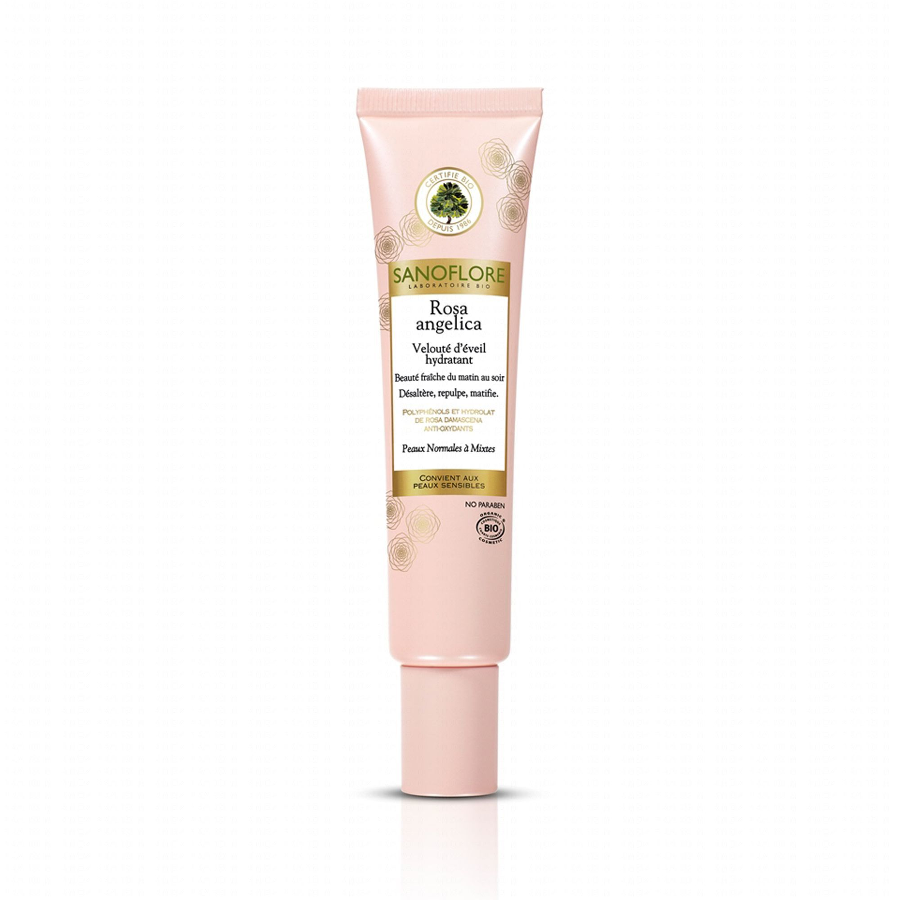

Rosa angelica, un nom poétique pour un crème idéale. Encore une fois, merci ma boutique préférée de produits bio ! A chaque fois que j’ai acheté un produit dans cette boutique, hop un échantillon de crème hydratante. J’ai donc pu testé pas mal de crème hydratante pour le visage. Un petit conseil de la vendeuse en supplément et j’ai acheté la crème hydratante Rosa angelica de Sanoflore. Crème pour les peaux normales à mixtes, elle convient parfaitement à mon type de peau. Dès le touché, j’ai été étonnée par sa texture fondante et pénétrante. Son parfum est délicat et non agressif.

40ml, de 19,59€ à 25,41€, en vente sur Internet et en boutique spécialisée

Ce produit est certifié.

Tip top la crème, mais quels sont les ingrédients de cette crème ?
De l’alcool !
Ci-dessous une extraction des ingrédients de la crème :

- de l'alcohol denat. =  Alcool dénaturé

- du benzyl alcohol = Conservateur

- du cetearyl alcohol = stabilisant d’origine naturelle

D’accord maintenant, tu sais ce qu’il y dans ton pot de crème, mais qu’est que ça veut dire ? On m’avait promit que cette crème était bénéfique pour ma peau !

L’alcool dénaturé est en fait de l’éthanol dénaturé, on dit que c’est un alcool méthylique (c’est n’est pas celui que l’on boit, berk, berk).  On l’appelle comme ça car on ajoute du méthanol dans l’alcool éthylique (l'alcool que tu connais, celui que tu bois). C’est bon, tu suis ? On dénature cet alcool pour des raisons fiscales et le problème de ce dernier c’est que ce sont les agents dénaturants qui sont fortement allergènes (éthers de glycols ou des phtalates). On utilise cet alcool en tant que solvants (mais au fait à quoi servent les solvants? Réponse plus tard) et en tant que conservateurs pour sa propriété antimicrobienne. De plus, son faible poids moléculaire lui permet d’être volatile et à l’origine d’une agréable sensation de fraîcheur ressentie lors de l’application de la crème. En s’évaporant, cet alcool emporte avec lui une partie de l’eau et des huiles contenus dans notre peau provoquant l’assèchement de cette dernière. Bon là, c’est vrai que je suis en train de t’expliquer que je mets une crème hydratante que m’assèche la peau ; mais pas de panique, dans la suite de cet article je vais t’expliqué que cette crème est tout de même bénéfique.

On a vu le plus mauvais, passons au benzyl alcohol. Cet alcool est un alcool neutre (ah ouf, tout n’est pas mauvais !). Il est utilisé en tant que solvant, antiseptique et conservateur. Il est naturellement présent dans certaines huiles essentielles et c’est une substance allergène dont la présence doit obligatoirement être mentionnée sur l’étiquette (pas vraiment bénéfique alors?). La concentration du benzyl alcool est limitée au maximum à 1%.

Puisque qu’on a vu le plus mauvais, le neutre, voyons le meilleur : l’alcool cétylique. Cet alcool est d’origine végétale (dérivé de l’huile de palme ou de coco) ou synthétique (dérivé du pétrole). Les alcools gras sont de bons agents émollients : ils assouplissent, adoucissent et protègent la peau en empêchant son dessèchement. Dans cette crème, l'alcool est d'origine naturelle. Cet alcool s'utilise en tant que tensioactif, émulsifiant et co-émulsifiant car ils permet de stabiliser les émulsions (ça fait beaucoup de mots que tu as déjà entendu mais tu ne sais pas trop ce qu'il veulent dire, hein? Ne dit pas le contraire ! Précisions plus tard). Cet alcool est apprécié aussi pour ces propriété épaississante et apporte un toucher onctueux et nourrissant à nos produits de beauté.

Après toutes ces mauvaises nouvelles, ça ne te donne plus envie de mettre cette crème sur ta peau, hein ? Pas de panique, les effets desséchants de l’alcool sont contrés par des agents surgraissants. C’est là qu’intervient le beurre de karité (5ième ingrédients dans la liste de la composition de la crème).

L'équilibre entre alcool et agents surgraissants qui annule l'effet asséchant de l'alcool n’est valable que si les substances sont judicieusement choisies et en contrôlant rigoureusement les proportions d’alcool et de ces substances surgraissantes.

Pas facile comme formule mag…chimique, hein ?

Beaucoup d’informations pour trois petits ingrédients, hein ? Mais retient que l’alcool à faible dose ne dessèche pas la peau (tout comme tu n’es pas bourré avec un verre de vin !). Comme pour l’alcool que l’on boit, il ne faut pas en abuser. Lit les étiquettes (c’est long et chiant mais c’est comme ça ou sinon il y a ce blog !) car les ingrédients inscrits au début de la liste sont présents en plus grande quantité que ceux inscrits à la fin (à l’exception des substances dosées à moins de 1% qui peuvent être listées dans le désordre). Et en dessous de 2%, l’alcool s’évapore à l’application, autant dire que son passage est bref ! Préfère les produits avec de l’alcool éthylique car il n’est pas dénaturé. Et enfin, fait confiance à la marque car chaque marque a des valeur et une éthique.

ET de l'eau
Pourquoi y a t-il de l'eau dans de la crème hydratante? Quand je bois de l'eau, cela m'hydrate alors ça doit aussi hydrater ma peau, non? Pas tout à fait vrai mais pas tout à fait faux non plus !

L'eau est utilisé est tant que solvant. En effet, elle est incomparable pour dissoudre des actifs à l’origine solides ou gazeux. Elle est dotée également de propriétés hydratantes, pour peu qu’elle soit accompagnée d’ingrédients qui freinent son évaporation à la surface de la peau. Mais elle a malgré tout tendance à rapidement s’évaporer lorsque l’on applique le produit. Mais, purifiée et stérile, l’eau n’apporte rien en elle-même, et est ainsi souvent qualifiée d’ingrédient « mort ». Ma crème est certifiée bio, l'eau est-elle bio? L'eau, si elle peut être des plus pures, et même 100 % naturelle, et même n’avoir subi aucun traitement chimique, l’eau ne peut jamais qualifiée de biologique. Tout simplement parce qu’elle n’est pas « cultivée » selon les critères de l’agriculture biologique…

Un petit conseil, cette crème est sympa mais varie les plaisirs. Moi j’utilise de l’hydrolat de camomille matricaire une fois sur deux et c’est sympa aussi.

Sources article Rosa Angelica :

http://blog.denovo-beaute.com/lalcool-dans-les-cosmetiques/

http://www.vanilline-cosmetiques.fr/faut-il-faire-la-chasse-a-lalcool-dans-nos-cosmetiques/

http://www.corinedefarme.fr/conseil-beaute/douche-surgras-kezako/

http://beautiful-boucles.com/zoom-sur-leau-la-base-de-nos-cosmetiques/

Source image :
https://www.parapharmacie-et-medicament.com/SANOFLORE-Rosa-Angelica-veloute-d-eveil-hydratant-peaux-normalese-/p/4/623/24406/