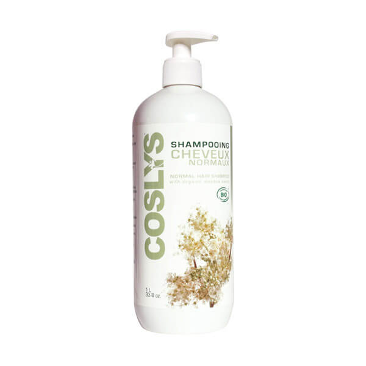

Il y a quelques années, j'ai choisi d'utiliser que des produits bio dans ma salle de bain. J'ai commencé par les produits que j'utilisais pour me laver, c'est-à-dire shampoing et savon.
Le premier produit bio que j’ai choisi d’utiliser est le shampoing Coslys, cheveux normaux. 

##Les avantages de ce shampoing

Ce shampoing existe dans toute les tailles : format voyage (250ml), familiale (5L). Mais surtout il existe des recharges.

L’odeur de ce shampoing est douce et agréable.

Un packaging est pratique.

Une texture agréable et une efficacité correcte.

##Les ingrédients de ce shampoing

* aqua
* spiraea ulmaria flower water*: zoom sur cette plante.
* sodium coco-sulfate : 
* decyl glucoside : Le glucoside de décyle est un tensioactif doux. Ce nettoyant est d' origine végétale, biodégradable et doux pour tous les cheveux.
* cocamidopropyl betaine : La bétaïne de cocamidopropyle est un tensioactif dérivé de l'huile de noix de coco. La diméthylaminopropylamine est un irritant connu de la peau et sa présence en tant qu'impureté dans la cocamidopropyl bétaïne est considérée comme étant la cause de l'irritation ressentie par certains individus.
* sodium chloride : Chlorure de sodium. Il s'agit de sel ! Le chlorure de sodium est utilisé pour faciliter la séparation des huiles.
* glycerin : ou glycérine : le glycérol est souvent utilisé comme agent hydratant, solvant et lubrifiant.
* mel (honey)*: miel
* coco-glucoside : Un glucoside est un glycoside dérivé du glucose. Je n'ai pas trouvé à quoi cela pouvait servir.
* glyceryl oleate : L'oléate de glycéryle est utilisé comme émulsifiant et co-tensioactif
* simmondsia chinensis (jojoba) seed oil*: huile de jojoba. L'huile de jojoba est la cire liquide contenue dans la graine de Jojoba (Simmondsia chinensis), plante buissonnante originaire du sud de l'Arizona et de la Californie, ainsi que du nord-ouest du Mexique. Propriétés hydratantes.
* hydrolyzed wheat protein : La protéine hydrolysée est une protéine qui a été au moins partiellement hydrolysée ou décomposée en ses acides aminés constitutifs. L'hydrolyse des protéines peut être utilisée pour modifier les propriétés allergéniques des préparations.
* parfum 
* coconut alcohol : Alcool cétéarylique. Alcool gras de coco. L’alcool cétéarylique s’utilise comme co-émulsifiant et agent de consistance pour stabiliser les émulsions et en moduler la texture.
* sodium sulfate : sulfate de sodium
* dehydroacetic acid : Acide déhydroacétique. C'est un conservateur.
* sodium benzoate : Benzoate de sodium. C'est un conservateur.
* benzyl alcohol : Alcool benzylique.
* linalool : Le linalol est un alcool possèdant une odeur florale et fraîche. On le retrouve notamment dans une majorité d'huiles essentielles notamment celle de lavande, de bergamote, de bois de rose, dont il est le composant majeur et de menthe. Ce composé organique est faiblement soluble dans l'eau.
* limonene : Le limonène est utilisé pour parfumer le shampoing.
* geraniol : le géraniol est un additif.

*Ingrédients issu de l'Agriculture Biologique

99% du total des ingrédients sont d'origine naturelle

10% du total des ingrédients sont issus de l'Agriculture Biologique

##Zoom sur la Reine-Des-Près

La spirée ulmaire ou la Reine-des-prés est une plante herbacée vivace de la famille des Rosacées, originaire de l'Europe. C'est une plante mellifère, c'est-à-dire qui produit beaucoup de nectar et de pollen de bonne qualité. Cette plante a été utilisée comme aromatisant pour les desserts mais aussi pour les dentifrice et les boissons. Elle peut être mise à macérer dans du vin ou de la bière pour les parfumer. Cette plante est également utilisée en médecine traditionnelle. Grâce à ses flavonoïdes (molécule qui assure la croissance, le développement d'un organisme), la reine des prés est principalement utilisée pour son action drainante, aidant à réduire les excès d'eau dans les membres.

Propriétés : anti-inflammatoire, diurétique, sudorifique, astringente, tonique, antispasmodique, cicatrisante, antalgique, elle possède aussi des propriétés digestives.
Les feuilles et les fleurs sont diurétiques, fébrifuges, antispasmodiques et antirhumatismales.
Les racines et les feuilles sont astringentes, vulnéraires et détersives.
Cette plante, en vente libre autorisée, fait partie de la pharmacopée française.

Principaux constituants connus : acide salicylique (en écrasant la plante entre les doigts, on sent l’odeur du salicylate de méthyle), fer, soufre, calcium, glucosides, gaulthérine, spiréine, héliotropine, vanilline, flavonoïdes, des tanins et de la vitamine C.

Ce n'est pas une plante menacée, mais elle a fortement régressé dans de nombreuses régions en raison du recul des zones humides suite aux drainages et/ou à leur comblement.

##Zoom sur le sodium coco sulfate
Le laurylsulfate de sodium (LSS) ou dodécylsulfate de sodium (SDS), plus connu sous sa dénomination INCI sodium lauryl sulfate ou SLS, est un détergent et tensioactif ionique fort.

Problèmes liés au SDS : 
- le SDS peut causer des affections de la peau (dont le nom général est la dermatite), certaines personnes étant plus affectées que d’autres
- les recherches toxicologiques effectuées par l'OSHA (Occupational Safety and Health Administration), le NTP (United States Department of Health and Human Services) ainsi que le CIRC (Centre international de recherche sur le cancer) appuient les conclusions de la Cosmetic, Toiletry and Fragrance Association,(CTFA) ainsi que l'American Cancer Society qui déclarent que SLES n'est pas cancérogène
- bien que le SLES soit légèrement moins irritant que le SDS, il peut se révéler dangereux par le fait qu’il n’est pas métabolisable par le foie
- le SDS est connu pour causer des ulcères aphteux ; il est référencé dans certains pays comme « rongeur de plaie »
- le SDS peut être utilisé en remplacement des SLES (pourtant moins irritants) pour la fabrication de savons, shampooings, lessives, dentifrices et autres produits de bains.

##Quelques définitions
Au cours de l'écriture de cet article, je me suis posée des questions sur la définition de quelques mots, ci-dessous quelques définitions de mots qui j'espère vous aideront à comprendre l'article.

* **Tensioactif** : Les tensioactifs, surfactifs ou surfactants, sont les composés indispensables à l'hygiène et à la cosmétologie. Ils dispersent les corps gras dans l'eau et constituent en quelque sorte le principe actif des agents lavants.

Le shampoing est disponible est magasin bio et sur le site Internet de la marque Coslys.

Site de la marque : <http://www.coslys.fr/>

Sources de mon article :
* https://www.coslys.fr/boutique/cheveux-normaux/109-shampooing-cheveux-normaux.html

#####Reine-Des-Près
* https://fr.wikipedia.org/wiki/Filipendula_ulmaria
* https://fr.wikipedia.org/wiki/Flavono%C3%AFde

#####Sodium coco sulfate
* https://fr.wikipedia.org/wiki/Laurylsulfate_de_sodium
* https://www.cdc.gov/niosh/ipcsnfrn/nfrn0502.html

#####Bétaïne de cocamidopropyle
* https://fr.wikipedia.org/wiki/B%C3%A9ta%C3%AFne_de_cocamidopropyle
* https://en.wikipedia.org/wiki/Dimethylaminopropylamine

#####Chlorure de sodium
* https://fr.wikipedia.org/wiki/Chlorure_de_sodium

#####Coco-glucoside
https://en.wikipedia.org/wiki/Decyl_glucoside

#####Oléate de glycéryle
* https://nutrawiki.org/glyceryl-oleate/

#####Huile de jojoba
* https://fr.wikipedia.org/wiki/Huile_de_jojoba

#####Protéine hydrolysée
* https://en.wikipedia.org/wiki/Hydrolyzed_protein

#####Alcool gras de coco
* http://www.mamzelleemie.com/zoom-sur-lalcool-cetearylique/

#####Acide déhydroacétique
* https://en.wikipedia.org/wiki/Dehydroacetic_acid

#####Linalol
* https://fr.wikipedia.org/wiki/Linalol

#####Géraniol
* https://fr.wikipedia.org/wiki/G%C3%A9raniol

#####Définitions :
* http://www.cnrs.fr/cw/dossiers/doschim/decouv/peau/tensio.html

#####Source image :
* https://www.greenweez.com/coslys-shampoing-bio-reine-des-pres-1l-p10685
