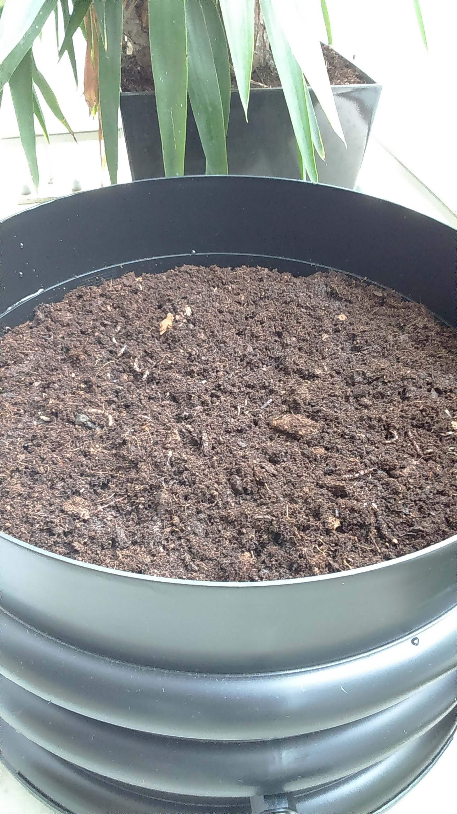
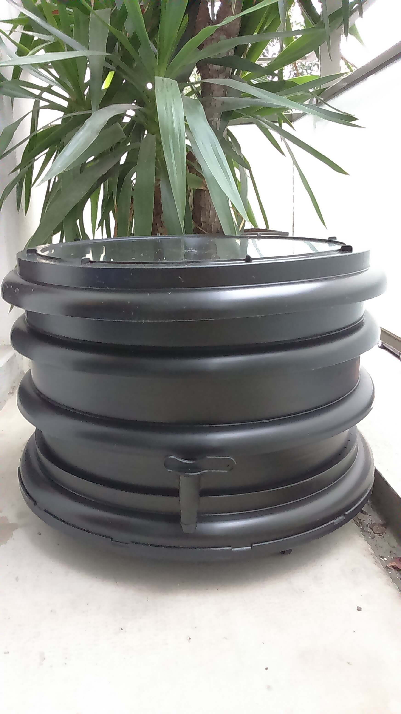

Il y a quelques années, j'ai adopté des vers de terre. Ces petits verres de terre ont accélèré ma transition écologique et je vous explique pourquoi dans cet article.

Le lombricompostage est le recyclage par les lombrics (les vers de terre) de nos déchets organiques quotidiens.

Le lombricompost récupéré est ensuite utilisé comme engrais écologique.

En effet dans la nature, les vers de terre effectuent le plus gros du travail de décomposition de la matière organique.

Le lombricompostage est très simple. Vous pouvez acheté un lombricomposteur ou le faire vous-même ou jeter vos déchets organiques dans les lombricomposteurs municipaux.

Pour ma part, j'ai acheté il y a quelques années un lombricomposteur. Ce fut un investissement très rentable car j'ai diminué mes déchets et j'ai obtenu de l'engrais pour mes plantes.

Ci-dessous deux photos au commencement du lombricompostage.

Source et site du produit : http://www.fermedumoutta.fr