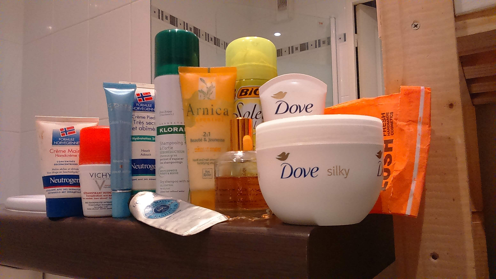

Il y a quelques temps, j'ai changé d'appartement. Je vous en parle car lors d'un déménagement c'est aussi l'occassion de faire du tri. J'ai donc fait du tri dans ma salle de bain. 

Ci-dessous, voici tous les produits dont je voulais me débarrasser car il n'était plus compatible avec mes principes écologiques.

J'ai déjà effectué le décrytage de 3 de ces produits. Mes recherches sur les ingrédients qu'ils contenaient m'ont amené à ne plus utiliser ces produits. J'ai donc fini par les jeter.

